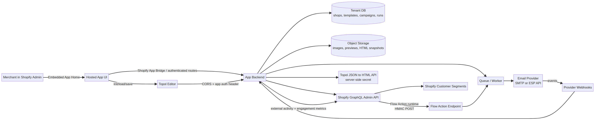

# Topol Plugin × Shopify Marketing App

## Research report and implementation-ready plan

**Prepared for:** Vincent Laroche, Founder

**Research date:** August 25, 2026

## Executive conclusion

This is a strong product opportunity, but the correct architecture is more specific than “embed Topol into Shopify Messaging.” The technically sound product is a **public, embedded Shopify marketing app** whose primary workspace is a developer-hosted App Home/iframe containing Topol, whose native automation surface is a **Shopify Flow Action extension**, and whose campaign/reporting integration uses Shopify’s GraphQL Admin API.

Topol should provide the **drag-and-drop editing experience, curated blocks, template JSON, HTML rendering, merge-tag UI, product selection, and reusable sections**. The Shopify app should own **tenant isolation, template persistence, Shopify product/customer/segment access, consent enforcement, campaigns, rendering orchestration, delivery, provider webhooks, analytics, and Shopify marketing activity reporting**. Topol explicitly documents that the host system stores templates rather than Topol itself, which makes this separation natural.[1]

The most important correction is the Shopify Messaging boundary. Shopify’s public documentation describes Shopify Messaging’s own editor, templates, campaigns, custom-coded HTML, segments, personalization, and native automations, but the reviewed developer documentation does **not** expose a public API that lets a third-party app inject arbitrary Topol JSON/HTML into the Shopify Messaging editor or ask Shopify Messaging to deliver an app-owned Topol template.[2] [3] This does not rule out a partner-only capability, but it means the product must not be designed around that assumption.

The first implementation should therefore use an **email-service-provider adapter** for actual message delivery. Shopify remains the system of record for shop identity, customer/segment context, Flow orchestration, external marketing activities, UTM attribution, and engagement reporting. If Shopify confirms an approved Messaging transport API, it can be added behind the same delivery adapter without redesigning the editor.

> **Recommended product definition:** “A Shopify-native email marketing app with a controlled Topol builder, Shopify segment targeting, Shopify Flow automations, Shopify marketing reporting, and provider-backed email delivery.”

## What the research establishes

| Question | Finding | Consequence |
|---|---|---|
| Can Topol provide the editor? | Yes. It supports embeddable initialization, callbacks, programmatic actions, custom blocks, saved/synced sections, merge tags, product feeds, custom API blocks, and server-side JSON-to-HTML rendering.[1] [4] [5] [6] [7] [8] [9] | Topol is a viable editor/rendering layer. |
| Where should the full editor live? | In a hosted embedded Shopify app/App Home page. Shopify recommends the iframe model for apps requiring backend logic, webhooks, background jobs, or browser APIs; Shopify-hosted App Home UI extensions are custom-distribution-only and constrained to a 64 KB compressed bundle.[10] [11] | Do not put the Topol runtime inside a UI extension. |
| What is the correct automation extension? | Shopify says new marketing automation integrations should use Flow triggers/actions. A marketing automation action must include the Marketing activity ID and calls app-hosted endpoints.[12] [13] [14] | Build a Flow Action extension first. |
| Should we build a marketing activity app extension? | No. Shopify marks creation of new marketing activity app extensions as deprecated and directs new marketing automations to Flow actions.[15] | Exclude this from the architecture. |
| Can campaigns appear in Shopify Marketing? | Yes, through GraphQL external marketing activity mutations. `marketingActivityUpsertExternal` supports a stable remote ID, title, manage URL, preview URL, status, UTM values, tactic, and channel.[16] [17] | Represent campaigns and sends as external marketing activities. |
| Can metrics be reported to Shopify? | Yes, through `marketingEngagementCreate`, which accepts delivery and engagement aggregates and requires `write_marketing_events`.[18] | Build provider-metric reconciliation into the delivery layer. |
| Can Shopify segments be used? | Yes. Segments are GraphQL-backed groups of members used for marketing, and Shopify provides a segment action extension in the “Use segment” modal.[19] [20] | Use live segment references, with an optional later segment action extension. |
| Can the app safely access email/customer data? | Yes, subject to minimum scopes, protected customer data/field approval for public distribution, consent, retention, encryption, and review requirements.[21] [22] | Treat compliance as a core feature, not launch paperwork. |

## Recommended architecture



The runtime should be divided into six explicit layers.

| Layer | Responsibility | Important rule |
|---|---|---|
| Shopify embedded UI | App Home, campaign list, settings, audience selection, analytics, hosted editor route | This is the merchant-facing application shell. |
| Topol editor | Drag-and-drop composition, curated block UI, template JSON, HTML preview, merge-tag insertion | Topol is not the tenant database or delivery system. |
| Shopify integration backend | GraphQL Admin API, segments, products, customers, Flow, marketing activities, webhooks | Shopify credentials stay server-side. |
| Template/rendering service | Canonical JSON, revisioning, synced-section resolution, JSON-to-HTML compilation, validation | JSON is canonical; HTML is derived/cache. |
| Delivery worker | Consent checks, provider calls, idempotency, retries, provider webhooks, suppression | Flow runtime must enqueue, not perform long sends synchronously. |
| Reporting layer | Provider metrics mapped to Shopify marketing engagement and internal dashboards | Metrics must be deduplicated and substantiated. |

### Primary Shopify surfaces

| Surface | Role in the product | Recommendation |
|---|---|---|
| **Hosted embedded App Home/iframe** | Full Topol editor, campaigns, templates, settings, and analytics | **Required for MVP.** |
| **Flow Action extension** | “Send marketing email” inside Shopify Flow and marketing automations | **Required for MVP.** |
| **External marketing activity GraphQL API** | Represent campaigns/sends in Shopify Marketing and connect manage/preview URLs | **Required for campaign reporting.** |
| **Customer-segment action extension** | “Use segment” entry point for selecting a campaign from a segment page | **Phase 2.** |
| **Customer-segment template extension** | Hair Solutions-specific segment query templates | **Phase 3 optional.** |
| **Admin action/block** | Contextual links/actions from Customer, Product, or Order pages | **Phase 3 optional.** |
| **Web pixel** | Storefront behavioral collection | **Not required for MVP.** |
| **Marketing activity app extension** | Legacy marketing activity form | **Do not build.** |
| **App Home UI extension** | Shopify-hosted Preact/Remote DOM surface | **Do not use as primary editor host.** |

Shopify documents Admin UI extensions as lightweight actions, blocks, and print actions on resource pages, not as general-purpose hosted application shells.[23] A later customer or order action can launch the hosted app, but it should not attempt to contain the Topol runtime.

## Topol integration design

### Initialization and current loader

Use the current Topol package or loader. Topol’s migration documentation states that version `0.3.0` moved to `https://v3.email-assets.topol.io/loader/build.js`; the deprecated loader domain is scheduled to shut down on September 15, 2026.[24] New code must use the current domain and must update CORS rules accordingly.

The host should configure `TOPOL_OPTIONS` with a shop-scoped browser credential, host-owned API endpoints, a curated block manifest, a merge-tag registry, and callbacks. The Topol Secret Key used for server-side JSON-to-HTML conversion must never be exposed to the browser.[9] [25]

```ts
const TOPOL_OPTIONS = {
  id: "#app",
  authorize: {
    apiKey: topolBrowserApiKey,
    userId: `${shopId}:${tenantUserId}`,
  },
  apiAuthorizationHeader: `Bearer ${shortLivedTopolSessionToken}`,
  api: {
    GET_AUTOSAVE: `${appOrigin}/api/topol/autosave`,
    AUTOSAVES: `${appOrigin}/api/topol/autosaves`,
    FEEDS: `${appOrigin}/api/topol/feeds`,
    PRODUCTS: `${appOrigin}/api/topol/products`,
    PRODUCT_CATEGORIES: `${appOrigin}/api/topol/product-categories`,
    IMAGE_UPLOAD: `${appOrigin}/api/topol/assets/upload`,
    SAVED_SECTIONS: `${appOrigin}/api/topol/saved-sections`,
  },
  customBlocks: curatedCustomBlocks,
  apiBlocks: curatedApiBlocks,
  mergeTags: shopSpecificMergeTags,
  savedBlocks: true,
  syncedSectionsEnabled: true,
  callbacks: {
    onSave: saveTemplate,
    onSaveAndClose: saveAndCloseTemplate,
    onTestSend: enqueueTestSend,
    onOpenFileManager: openAppAssetPicker,
    onImageDelete: deleteOrArchiveAppAsset,
    onError: recordTopolError,
    onInit: () => window.TopolPlugin.setMergeTags(shopSpecificMergeTags),
  },
};
```

Topol’s callback contract includes `onSave(json, html, mutations, syncedSections)`, `onSaveAndClose`, `onTestSend`, file-manager callbacks, initialization/loading callbacks, preview callbacks, saved-block callbacks, unsaved-change state, and error reporting.[26] The app should use the callbacks to synchronize the host application, but it should keep persistence and authorization in server routes.

### Template persistence

Topol’s documented load/save model is exactly what this product needs: the host loads a stored JSON template with `TopolPlugin.load()`, and Topol returns JSON plus rendered HTML through `onSave()`.[7] The database should store the following fields.

| Field | Purpose |
|---|---|
| `definition_json` | Canonical editable Topol document. |
| `html_snapshot` | Derived preview/cache; never the only source of truth. |
| `subject` and `preheader` | Campaign metadata, with subject also available in Topol JSON. |
| `mutations` | Multilingual template state. |
| `synced_section_ids` | Server-side resolution inputs. |
| `topol_version` and `schema_version` | Migration and compatibility control. |
| `revision` | Optimistic concurrency and rollback. |
| `validation_warnings` | Publish/send diagnostics. |
| `author_staff_id` | Audit trail. |

### Curated blocks

The product promise is that the merchant gets **exactly the blocks we choose**. Implement that promise as a versioned block manifest owned by the app.

| Block family | Initial blocks | Topol mechanism |
|---|---|---|
| Brand/layout | Header, logo, hero, divider, social row, legal footer | Custom `mix` blocks and Synced Sections. |
| Conversion | CTA, offer card, discount, review quote, urgency strip | Custom blocks with restricted attributes. |
| Catalog | Product card, product grid, collection rail | Topol Product block or Custom API Block. |
| Personalization | First name, order number, recovery link, unsubscribe, web version | Merge tags. |
| Compliance | Unsubscribe, preference center, physical address, sender identity | Mandatory Synced Section/server validation. |
| Advanced | Loops, conditional content, multilingual variants | Add after basic rendering/delivery is proven. |

Topol custom blocks support core block-based definitions, mixed blocks, disabled/beta states, restricted attributes, and custom-dialog blocks.[4] Custom HTML blocks must be treated as untrusted input and sanitized or rejected at publish time. Global footer, header, and compliance content should be Synced Sections, while campaign-specific fragments should remain independent Saved Blocks or custom blocks.

Topol warns that Synced Sections are stored as lightweight references and must be resolved server-side before final HTML generation; otherwise they render as empty placeholders.[5] The app must therefore persist synced-section IDs and always pass their definitions and translations into the JSON-to-HTML call.

### Product blocks and Shopify feeds

Topol’s built-in Product block and Custom API Blocks support static and dynamic product content. Topol’s product contract expects paginated feeds, products, optional categories, stable IDs, names, URLs, images, numeric prices, and currency values.[8] [27] The app should expose these endpoints from a Shopify-backed cache rather than querying Shopify directly for every editor interaction.

For static product blocks, save Shopify product/variant GIDs and a render snapshot, then revalidate at publish time. For dynamic blocks, use app-owned loop tags and resolve product arrays in the delivery worker. Avoid depending on Topol’s documented SparkPost-specific dynamic mode unless SparkPost is selected as the provider.[27]

### Merge-tag registry

Use stable, namespaced app-owned values such as `{{ customer.first_name }}`, `{{ order.recovery_url }}`, `{{ cart.items }}`, `{{ product.recommendations }}`, `{{ unsubscribe_url }}`, and `{{ web_version_url }}`. Topol supports grouped/nested merge tags, default preview values, smart merge tags, custom syntax, dynamic updates, and loop merge tags.[6]

The app should maintain different allowed tag registries by execution context.

| Context | Allowed content |
|---|---|
| Broadcast | Customer fields, shop/brand, unsubscribe/preferences, static catalog. |
| Customer-triggered Flow action | Customer plus event/order/abandonment fields available in the workflow. |
| Abandoned checkout/cart | Customer, recovery URL, cart items, product/item fields, configured discounts. |
| Preview/test | Sample values only, unless the merchant explicitly chooses an authorized test customer. |

Call `setMergeTags()` inside Topol’s `onInit`; Topol documents that calling it immediately after `init()` can be lost while the editor iframe is registering listeners.[6] At send time, fail validation for unknown or context-incompatible tags instead of leaking raw syntax.

## Shopify marketing and automation integration

### Customer segments

Shopify defines a segment as a group of members satisfying query criteria; segments are used for marketing, analytics, and reporting, and members can belong to multiple segments.[19] Shopify says segmentation replaces the older SavedSearch model, so the app should use the current Segment/Customer Segment APIs rather than saved-search assumptions.

A campaign should store a **live segment reference** by default, not a permanently copied recipient list. At send time, resolve the segment, page through eligible members, re-check email marketing consent and suppression status, then record whether the run used a live audience or a snapshot. The UI should display the audience policy clearly.

Shopify provides a customer-segment action extension in the **Use segment** modal. It receives the selected segment through the Admin UI extension API and can query segment/customer data directly.[20] This is a good Phase 2 entry point, but the extension should be a thin selector/launcher; the full editor and send pipeline stay in the hosted app.

### Flow Action extension

Shopify marketing automations support custom triggers and actions. A marketing automation action must include the Marketing activity ID Shopify property, and the resulting action is also available in Shopify Flow.[12] [13]

The first action should be named **Send marketing email**. Its configuration should include a merchant-selectable campaign, required Marketing activity ID, required Customer reference for customer-triggered workflows, and optional Order/Product/Abandonment references for contextual personalization.

Conceptual extension configuration:

```toml
api_version = "2026-07"

[[extensions]]
name = "Send marketing email"
type = "flow_action"
handle = "send-marketing-email"
description = "Send a saved email campaign to a customer"
runtime_url = "/api/flow/actions/send-marketing-email"

[settings]
  [[settings.fields]]
  type = "customer_reference"
  required = true

  [[settings.fields]]
  type = "marketing_activity_id"
  required = true

  [[settings.fields]]
  type = "single_line_text_field"
  key = "campaign_id"
  name = "Campaign"
  description = "The published campaign to send"
  required = true
```

The exact field type and TOML syntax must be checked against the current Shopify CLI schema before implementation. The preferred merchant experience is a custom configuration page that shows a campaign selector, subject, preview image, and last-updated time. Shopify documents custom configuration preview and validation endpoints for this purpose.[14] [28]

### Flow runtime behavior

A Flow action runtime request includes `shop_id`, `shopify_domain`, `action_run_id`, `handle`, optional `step_reference`, legacy `action_definition_id`, and configured properties.[28] The endpoint must:

1. Verify Shopify’s HMAC before parsing/processing the request.
2. Verify the action `handle` against an allowlist.
3. Derive and validate the shop from the signed request.
4. Validate that the campaign is owned by the shop, published, and provider-ready.
5. Insert `action_run_id` into a durable idempotency table before enqueueing.
6. Resolve customer/order/abandonment context through Shopify GraphQL.
7. Re-check consent, suppression, and template compatibility.
8. Enqueue the rendering/send job.
9. Return `202 Accepted` quickly for asynchronous work.
10. Update Shopify activity state and metrics asynchronously.

Shopify documents a maximum ten-second wait for a runtime response, retries for `202`/5xx/eligible `429` responses, and recommends using `action_run_id` as an idempotency key.[28] The app must never send synchronously before the idempotency record is durable.

### Marketing activity lifecycle

The app should use `marketingActivityUpsertExternal` for standalone campaigns and sends. Shopify’s current reference documents `write_marketing_events` as the required scope and supports a stable `remoteId`, `title`, `remoteUrl`, `status`, UTM values, tactic, and `marketingChannelType`.[16]

```graphql
mutation UpsertExternalActivity($input: MarketingActivityUpsertExternalInput!) {
  marketingActivityUpsertExternal(input: $input) {
    marketingActivity { id title status }
    userErrors { field message }
  }
}
```

Use the app’s campaign/send ID as `remoteId`, provide an authenticated manage URL and preview URL, use `EMAIL` as the marketing channel, and generate a unique UTM tuple per shop/campaign/send. Use `marketingActivityUpdateExternal` when the title, preview, or status changes.[17]

After provider delivery events are aggregated, call `marketingEngagementCreate` with sends, failures, views, unique views, clicks, unique clicks, unsubscribes, complaints, sessions, orders, and sales only where the app can substantiate the metric.[18] The app should store the last reported aggregate and use cumulative or daily semantics consistently to avoid double counting.

The `MarketingActivity` and `MarketingEvent` objects expose title, status, tactic, channel, UTM values, remote IDs, manage URLs, and preview URLs, which supports a Shopify listing that links back to the app.[29] [30]

## Shopify Messaging boundary

Shopify Messaging’s help documentation describes a native editor with sections such as text, buttons, images, collections, products, discount, footer, custom Liquid, and marketing-automation-specific abandoned-browse/cart/checkout sections.[2] Shopify also documents campaigns sent to all subscribers or customer segments, personalization, test sends, scheduling, UTM editing, and custom-coded `.html` messages.[3]

The reviewed public docs do **not** document a third-party mutation for “create Shopify Messaging campaign from arbitrary app HTML” or “send this external Topol template through Shopify Messaging.” The safe product positioning is therefore:

> The app integrates with Shopify’s marketing data, segments, Flow, and reporting surfaces, while the app/provider owns the rendering and transport unless Shopify grants an approved Messaging transport API.

Build a provider interface with `send`, `sendBatch`, `sendTest`, `handleWebhook`, and `getMetrics`. A Shopify Messaging adapter can be added later if Partner support confirms a supported public or partner-only contract. This avoids a breaking rewrite.

## Data model

| Entity | Key fields | Purpose |
|---|---|---|
| `shop` | Domain, encrypted offline token, scopes, API version, install status | Tenant and Shopify auth boundary. |
| `topol_template` | JSON, HTML cache, subject, preheader, Topol/schema version, synced IDs, revision | Canonical editable design. |
| `template_revision` | Immutable JSON/HTML, author, warnings, created time | Rollback and deterministic campaign content. |
| `saved_section` / `synced_section` | Definition, type, folder, translation, preview, revision | Reusable and globally synchronized blocks. |
| `campaign` | Template revision, audience policy, segment GID, provider, sender, UTM, status, remote ID | Sendable marketing asset. |
| `flow_action_binding` | Shop, action/step, campaign ID, config, activity GID, status | Workflow-to-campaign mapping. |
| `delivery_run` | Action run ID/send ID, audience mode, counts, state, provider IDs | Idempotent send execution. |
| `consent_snapshot` | Customer hash/GID, consent state, source, timestamp | Evidence of send-time consent. |
| `provider_event` | Provider event ID, type, run/campaign ID, timestamp | Deduplicated delivery/open/click/bounce/complaint/unsubscribe events. |

## Security and compliance

A public app requesting customer email/name/address/phone/order data must complete Shopify’s protected customer data access process and implement data minimization, transparency, stated-purpose processing, consent/opt-out handling where applicable, retention limits, encryption, and data-protection agreements.[21] Shopify’s Level 2 requirements also include encrypted backups, production/test separation, data-loss prevention, least-privilege staff access, access logging, and incident response.

The implementation must keep Shopify client secrets, offline tokens, Topol Secret Keys, ESP credentials, signing keys, and webhook secrets server-side. Every Topol endpoint must derive the shop from the authenticated app session rather than trusting `userId`, `entity_id`, `hostname`, or `key` values supplied by the browser. Every Shopify Flow and webhook request must pass HMAC verification; provider webhooks must pass provider-signature verification.

Use tenant-scoped database queries, encrypted PII, hashed recipient identifiers in logs, no PII in UTM values or preview URLs, explicit retention, and separate test/production data. Register uninstall and privacy/compliance webhooks. Shopify warns that webhook delivery is not guaranteed and ordering is not guaranteed, so add reconciliation jobs using timestamp filters.[22]

## Implementation roadmap

### Phase A — Delivery and API discovery gate

Confirm with Shopify Partner support whether a public or partner-only Shopify Messaging send/template API exists, whether `marketingActivityUpsertExternal` is available to this app distribution, and which Flow action field types and scopes are valid in API version `2026-07`. Confirm Topol commercial-plan rights for custom blocks, Custom API Blocks, storage, white-labeling, and server rendering.

### Phase B — Shopify foundation

Scaffold the embedded app, configure managed installation/token exchange, store encrypted offline sessions, register lifecycle/privacy webhooks, and implement GraphQL access with a pinned supported API version. Prove install/uninstall/reinstall, HMAC verification, and tenant isolation in a development store.

### Phase C — Topol persistence and editor shell

Embed Topol with the current loader, implement the server-minted short-lived Topol session credential, wire save/load/autosave/assets/saved sections/product feeds, and persist canonical JSON plus revision metadata. Add optimistic concurrency and rollback.

### Phase D — Curated blocks and product feeds

Implement the versioned block manifest, brand/compliance Synced Sections, product feed endpoints, Shopify product cache, static product blocks, and publish-time validation. Add image/URL/HTML restrictions.

### Phase E — Render and merge-tag compiler

Implement the context-aware merge-tag registry, Topol `onInit` tag loading, synced-section resolution, server-side Topol JSON-to-HTML conversion, provider-neutral intermediate tags, render snapshots, test renders, and content validation.

### Phase F — Delivery provider and compliance

Implement the ESP adapter, consent/suppression checks, unsubscribe/preferences routes, provider webhooks, idempotent delivery state machine, bounce/complaint processing, and test sends. Choose the first provider only after the required sender, consent, webhook, and metric capabilities are verified.

### Phase G — Shopify marketing activity and Flow

Upsert external marketing activities, configure manage/preview URLs and UTMs, report engagement metrics, create the Flow Action extension, implement custom configuration preview/validation, verify HMAC/handle/idempotency, and exercise customer/order/abandonment flows on a Plus development store.

### Phase H — Segment action, analytics, and App Store launch

Add the “Use segment” action extension, live/snapshot audience policy, dashboards, audit trails, protected-data review package, App Store listing/support process, billing, and the full deliverability/client-rendering test suite.

## Decision register

| ID | Decision | Status |
|---|---|---|
| D1 | Hosted embedded App Home is the primary editor surface. | Decided |
| D2 | Flow Action is the primary Shopify-native automation surface. | Decided |
| D3 | New marketing activity app extension is excluded because it is deprecated. | Decided |
| D4 | External GraphQL marketing activities represent campaigns/sends. | Recommended; verify in development store |
| D5 | Topol JSON is canonical; HTML is derived/cache. | Decided |
| D6 | Shopify Messaging transport remains an explicit discovery gate. | Blocking product-positioning decision |
| D7 | Delivery is abstracted behind an ESP/provider adapter. | Decided |
| D8 | Curated blocks are controlled by a versioned app-owned manifest. | Decided |
| D9 | Customer-segment action extension is Phase 2, not MVP critical path. | Recommended |
| D10 | No Topol or Shopify secrets are exposed to the browser. | Decided |

## Main risks and mitigations

| Risk | Mitigation |
|---|---|
| No public Shopify Messaging injection/send API | Use ESP adapter; present Shopify integration as segments/Flow/marketing/reporting; add Messaging adapter only after confirmation. |
| Flow retries duplicate sends | Durable idempotency on `action_run_id` plus provider idempotency keys. |
| Protected customer data is redacted or denied | Request minimum fields, implement redaction-aware failure paths, and build consent/suppression checks. |
| Synced Sections render empty | Resolve every synced ID server-side and test HTML output. |
| Topol/provider merge-tag mismatch | Use app-owned intermediate tags and a provider compiler. |
| Product/catalog rate limits | Cache/paginate GraphQL queries and reconcile asynchronously. |
| Email-client rendering defects | Add Gmail, Outlook, Apple Mail, and mobile rendering tests before launch. |
| Topol plan does not include required features | Confirm commercial plan before block architecture is finalized. |
| App Store review rejects PII/email behavior | Implement protected-data, privacy, retention, support, and deletion controls from the first build. |

## Open questions to close before coding deeply

1. Does Shopify provide a public or partner-only API for creating/sending a custom Shopify Messaging campaign from external HTML?
2. Is `marketingActivityUpsertExternal` available to a new public app in the target API version without partner enablement?
3. What exact Flow Action TOML field type should represent a merchant-selectable campaign resource, and can the custom configuration page persist the campaign binding directly?
4. Which customer email/consent fields and segment membership queries are available after protected-data approval for the target distribution?
5. Which Flow triggers and abandonment fields are available to public apps, and what reporting is required for each?
6. Which Topol commercial plan includes custom blocks, Custom API Blocks, custom storage, white-labeling, and server rendering?
7. Which email provider meets the operating geography, consent, deliverability, webhook, and Shopify attribution requirements?
8. Is the first deployment for Hair Solutions Co. custom distribution, or is public App Store distribution the initial target? This changes review and data-access sequencing.

## Recommended next step

Do not start by building the full editor. First close the **Shopify Messaging transport question**, validate external marketing activity mutations in a development store, and validate a minimal Flow Action that enqueues a test email. Once those boundaries are confirmed, build the Topol editor shell and curated block manifest on top of the stable backend contract. This ordering protects the product from the only major architectural uncertainty while preserving the core opportunity: a Shopify-native, controlled email builder that is much easier to use than raw HTML or Shopify Messaging’s native editor.

## References

[1]: [Topol Plugin documentation — Embed, customize, deploy](https://docs.topol.io/)
[2]: [Shopify Help — Managing Shopify Messaging templates](https://help.shopify.com/en/manual/promoting-marketing/create-marketing/shopify-messaging/email/create-email/templates)
[3]: [Shopify Help — Create email marketing campaigns using Shopify Messaging](https://help.shopify.com/en/manual/promoting-marketing/create-marketing/shopify-messaging/email/create-email/create-campaigns)
[4]: [Topol — Custom Content Block](https://docs.topol.io/guide/custom-block.html)
[5]: [Topol — Saved blocks and synced sections](https://docs.topol.io/guide/saved-blocks.html)
[6]: [Topol — Merge Tags](https://docs.topol.io/guide/merge-tags.html)
[7]: [Topol — Loading and saving a template](https://docs.topol.io/guide/how-to-load-and-save-template.html)
[8]: [Topol — How to connect to your API](https://docs.topol.io/guide/how-to-work-with-your-api.html)
[9]: [Topol — JSON to HTML](https://docs.topol.io/guide/operations/convertJson2Html.html)
[10]: [Shopify — App Home UI extensions](https://shopify.dev/docs/apps/build/app-home/app-home-ui-extensions)
[11]: [Shopify — App Home UI extension reference](https://shopify.dev/docs/api/app-home-ui-extension/latest)
[12]: [Shopify — Apps for marketing](https://shopify.dev/docs/apps/build/marketing)
[13]: [Shopify — About marketing automations](https://shopify.dev/docs/apps/build/marketing/automations)
[14]: [Shopify — Create a marketing automation action](https://shopify.dev/docs/apps/build/marketing/automations/create-marketing-automation-actions)
[15]: [Shopify — About marketing activities](https://shopify.dev/docs/apps/build/marketing/marketing-activities)
[16]: [Shopify GraphQL Admin API — marketingActivityUpsertExternal](https://shopify.dev/docs/api/admin-graphql/latest/mutations/marketingActivityUpsertExternal)
[17]: [Shopify GraphQL Admin API — marketingActivityUpdateExternal](https://shopify.dev/docs/api/admin-graphql/latest/mutations/marketingActivityUpdateExternal)
[18]: [Shopify GraphQL Admin API — marketingEngagementCreate](https://shopify.dev/docs/api/admin-graphql/latest/mutations/marketingEngagementCreate)
[19]: [Shopify — About customer segments](https://shopify.dev/docs/apps/build/marketing/customer-segments)
[20]: [Shopify — Build a customer segment action extension](https://shopify.dev/docs/apps/build/marketing/customer-segments/build-an-action-extension)
[21]: [Shopify — Work with protected customer data](https://shopify.dev/docs/apps/launch/protected-customer-data)
[22]: [Shopify — About webhooks](https://shopify.dev/docs/apps/build/webhooks)
[23]: [Shopify — Apps in admin](https://shopify.dev/docs/apps/build/admin)
[24]: [Topol — Update the Plugin Loader URL](https://docs.topol.io/guide/new-topol-plugin-loader-url.html)
[25]: [Topol — How to get a Secret Key](https://docs.topol.io/guide/how-to-get-secret-key.html)
[26]: [Topol — Callbacks](https://docs.topol.io/guide/callbacks.html)
[27]: [Topol — Ecommerce Products and Custom API Blocks](https://docs.topol.io/guide/products.html) [Custom API Blocks](https://docs.topol.io/guide/custom-api-blocks.html)
[28]: [Shopify — List of action endpoints](https://shopify.dev/docs/apps/build/marketing/automations/action-endpoints)
[29]: [Shopify GraphQL Admin API — MarketingActivity](https://shopify.dev/docs/api/admin-graphql/latest/objects/MarketingActivity)
[30]: [Shopify GraphQL Admin API — MarketingEvent](https://shopify.dev/docs/api/admin-graphql/latest/objects/MarketingEvent)
[31]: [Shopify — About app extensions](https://shopify.dev/docs/apps/build/app-extensions)
[32]: [Shopify — List of app extensions](https://shopify.dev/docs/apps/build/app-extensions/list-of-app-extensions)
[33]: [Shopify — About app authentication](https://shopify.dev/docs/apps/build/authentication-authorization)
[34]: [Shopify — About GraphQL](https://shopify.dev/docs/apps/build/graphql)
[35]: [@topol.io/editor on npm](https://www.npmjs.com/package/@topol.io/editor)
